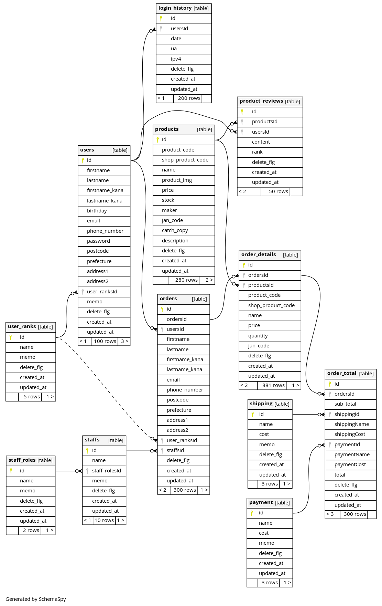

# Schemaspy

DB構築(DDL)をER図でチェックする。

- マイグレーションツール phpmig を使いDDLを記述
- Fakerを利用しダミーデータを投入
- 正規化できているか
- 外部キーは適切に設定されているか
- INDEXは適切に設定されているか
- schemaspyを利用しブラウザからヴィジュアルで確認できるようにする
    - 定義書
    - ER図

**ER図 ( Schemaspy )**

