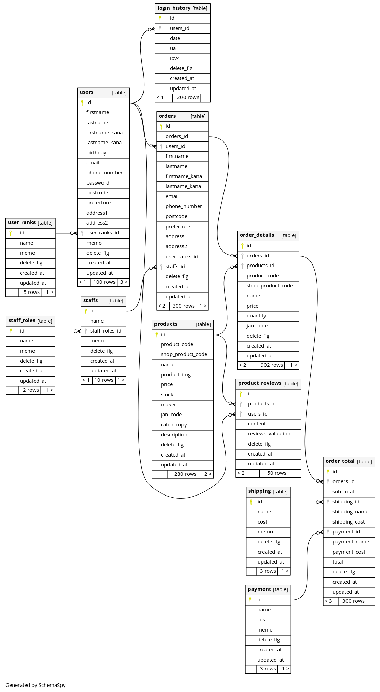

# Schemaspy

DB構築(DDL)をER図でチェックする。

- 正規化できているか
- 外部キーは適切に設定されているか
- INDEXは適切に設定されているか
- schemaspyを利用しブラウザからヴィジュアルで確認できるようにする
    - 定義書
    - ER図

**ER図 ( Schemaspy )**

## Usage

- DBに変更があった場合は
  - `docker-compose run --rm schemaspy_laravel_mysql`
  - `docker-compose run --rm schemaspy_laravel_postgres`
